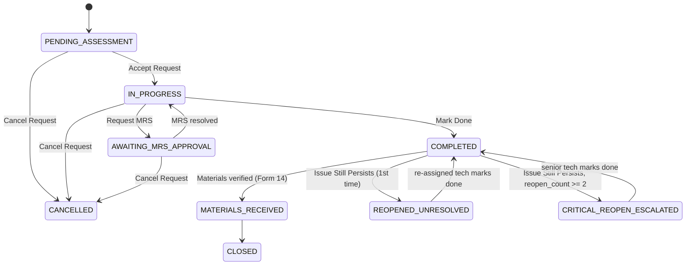
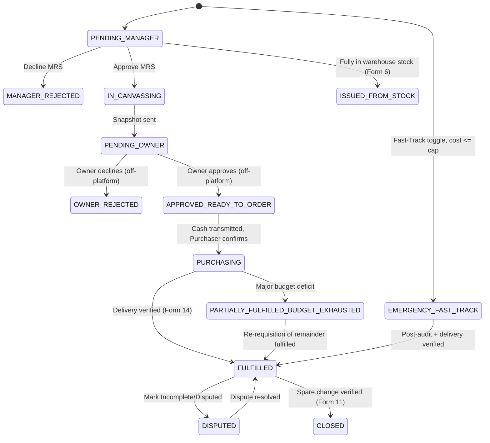

# FixFlow ERP — Master Implementation Plan (Merged & Conflict-Resolved)

**Status:** Single source of truth. This document replaces the "Feature Blueprint" PDF,
`PLAN.md`, and `PLAN-ADDENDUM.md` as three separate inputs. Give **only this file** to the
coding agent — do not also attach the two original PDFs, or contradictions will resurface.

**How this was built:** Every field, status, and access rule below was cross-checked across
all three source documents. Where they disagreed, the Addendum's resolution was applied.
Where I found *additional* disagreements the Addendum didn't cover, I've resolved them the
same way and flagged them in §0 so you can override my call before build starts.

---

## 0. New Conflicts Found During Merge (not in the original Addendum)

| # | Issue | Resolution applied in this doc |
|---|---|---|
| 1 | `user_role` enum (both docs' DDL) never included `STOREKEEPER`, yet Form 6 is explicitly restricted to "Storekeeper, Super Admin" in both docs. | Added `STOREKEEPER` to `user_role`. Form 18's role list updated to match. |
| 2 | Emergency Fast-Track (Addendum §4) says it skips Forms 7, 8, and 10 and lets the requester "proceed straight to purchase" — but never says whether it also skips **Form 6** (Storekeeper stock-check gate). | Resolved: fast-track skips Form 6 too. If it didn't, "proceed straight to purchase" would be false — the ticket would still sit in the Storekeeper's queue. This is flagged as an assumption; confirm before Phase 5. |
| 3 | Table count: the Addendum's own header says it "closes the 11-tables gap," but 7 original + 4 new (§2) = 11, and a 12th (`number_sequences`, §5) is also added. | Treat the schema as **12 tables total**. Don't let the agent stop at 11 and treat `number_sequences` as optional — it's required for §5's numbering function to work at all. |
| 4 | `transmittal_type` enum (Blueprint DDL) includes `ONLINE_COD_ADVANCE`, which is never referenced by any of the 18 form specs in either document. | Kept in the enum for forward-compatibility, but no form wires it up. Flagged so the agent doesn't try to guess a UI for it. |
| 5 | Neither source doc defines what happens to a `material_requisitions` row's `overall_status` while it sits in Form 6 before the Storekeeper acts. Both imply a default but never state it as an enum value already used elsewhere. | Use the existing `PENDING_MANAGER` only *after* Form 6 forwards a partial/no-stock result to Form 7. While a fresh MRS is awaiting the Storekeeper's initial look, its `overall_status` stays at the row's `DEFAULT 'PENDING_MANAGER'` from the DDL — Form 6 is a gate a Manager-approval-stage row passes through, not a separate status. No new enum value needed. |
| 6 | `mrs_status` enum (§3.1) has no `CLOSED` value, yet Form 11 ("Verify Cash & Mark Spare Change Received" → "MRS → `CLOSED`") and the cascade trigger's `overall_status NOT IN ('FULFILLED', 'CLOSED')` clause both reference it. As written, the trigger will fail at creation time with `invalid input value for enum mrs_status: "CLOSED"`. | Added `'CLOSED'` to `mrs_status` (§3.1) as the true terminal state reached after spare-change is verified. Added `FULFILLED --> CLOSED` to the §4.2 diagram. `FULFILLED` remains reachable but is no longer the final state once cash has been settled. |
| 7 | Form 2 gates `[Cancel Request]` to "enabled only while `PENDING_ASSESSMENT`," and the §4.1 diagram only draws `PENDING_ASSESSMENT --> CANCELLED`. But §6.C (Cascade Cancellation Lock) and Test Protocol #9.4 both describe canceling a JO **after** its linked MRS has "advance[d] to canvassing" — which requires the JO to already be past `PENDING_ASSESSMENT` (MRS can only be requested once a JO is `IN_PROGRESS`, via Form 3). The cancel button as scoped could never fire the cascade it's supposed to test. | Widened `[Cancel Request]` to also be enabled from `IN_PROGRESS` and `AWAITING_MRS_APPROVAL` (any state before `COMPLETED`). Added `IN_PROGRESS --> CANCELLED` and `AWAITING_MRS_APPROVAL --> CANCELLED` to the §4.1 diagram. Form 2's gating text updated to match. |
| 8 | Form 13's checklist lists item delivery statuses as "PURCHASED/IN_TRANSIT/BACKORDERED/BUDGET_EXHAUSTED/UNAVAILABLE" — but `item_delivery_status` (§3.1) has no `PURCHASED` value; it has `PENDING` and `DELIVERED` instead, and Form 13 never mentions `DELIVERED`. | Form 13's spec corrected to reference the real enum values: `PENDING / IN_TRANSIT / DELIVERED / BACKORDERED / BUDGET_EXHAUSTED / UNAVAILABLE`. `PENDING` is the pre-purchase default and isn't manually set from this form. |
| 9 | The two highest-write tables — `job_orders` and `material_requisitions` — only have a `FOR SELECT` RLS policy each in §3.3 (`mrs_line_items` too). Postgres RLS default-denies any command with no matching policy, so as written, **no one could INSERT a new JO/MRS or UPDATE a status** once RLS is enabled — the app would be read-only. | Added baseline `INSERT`/`UPDATE` policies for all three tables to §3.3 (own-row insert for requesters; role-scoped update for the staff who act on each status transition). Flagged as needing a full per-transition audit before Phase 1 sign-off — the sketch policies are a floor, not a final spec. |
| 10 | §4.1's diagram draws `REOPENED_UNRESOLVED --> CRITICAL_REOPEN_ESCALATED: reopen_count >= 2` as if escalation fires from the `REOPENED_UNRESOLVED` state itself. But Form 2 says `[Issue Still Persists]` is "enabled only after `COMPLETED`," and the only path back to `COMPLETED` from `REOPENED_UNRESOLVED` is "re-assigned tech marks done." So the *second* "Issue Still Persists" click — the one that should trigger escalation — is fired from `COMPLETED`, not from `REOPENED_UNRESOLVED`. | Diagram corrected: `COMPLETED --> CRITICAL_REOPEN_ESCALATED: Issue Still Persists, reopen_count >= 2` replaces the old edge. `COMPLETED --> REOPENED_UNRESOLVED` (first reopen) is unchanged. |
| 11 | §2's role/form access table never lists Form 9 for any role except implicitly `SUPER_ADMIN` ("All forms") — but Form 9's own spec says "Access: All roles, filtered." A coding agent building route guards purely off the §2 table would lock every non-admin role out of Form 9. | Added Form 9 to every role's row in §2. |
| 12 | Every table's DDL in §3.2 (both source docs) used `id INT PRIMARY KEY AUTO_INCREMENT` — `AUTO_INCREMENT` is MySQL syntax. It does not exist in PostgreSQL and every one of these 10 `CREATE TABLE` statements would fail on Supabase as written. | Replaced with `id SERIAL PRIMARY KEY` (Postgres auto-incrementing integer) across all 10 affected tables in §3.2. |

If any of rows 1–12 need a different call, edit this table and the corresponding section before implementation starts — everything downstream in this file assumes the resolutions above.

---

## 1. System Overview & Core Objectives

FixFlow ERP is a multi-department operational, procurement, financial, and preventive
maintenance web application for organizations such as hotels, resorts, and commercial
complexes. It runs natively in Philippine Peso (₱) and connects ground-level staff requests to
accounting ledgers, asset upkeep schedules, and executive (Owner) approval — without
requiring the Owner to log into the app.

**Stack:** Next.js 14+ (App Router), Supabase (PostgreSQL, Auth, Storage), Tailwind CSS,
Progressive Web App (PWA).

**Core architectural principles:**
- **Actual-spent bookkeeping baseline.** Every financial report is computed from verified vendor receipts, never canvassed estimates:
  `Total MRS Spent = Σ(Actual Unit Price_i × Fulfilled Qty_i) + Actual Shipping Fee`
- **Four-step chain-of-custody ledger.** Every peso moved between Accounting, Budget Officers, Purchasers, or the Front Desk revolving float requires a signed digital transmittal and dual-party confirmation.
- **Frictionless Owner approval.** Budget Officers export a 1-click PNG/PDF snapshot of canvassed pricing to Messenger/WhatsApp; the Owner's off-platform APPROVED/REJECTED reply is logged back into the system manually by the Budget Officer.
- **Audit-safe soft deactivation.** User rows are never deleted. Deactivating a user sets `account_status = INACTIVE`, which blocks login but preserves every historical signature.
- **PWA with hardware access.** Rear-camera capture for receipts/site photos, barcode scanning for COD deliveries.

**Required packages:** `next`, `react`, `react-dom`, `@supabase/supabase-js`, `@supabase/ssr`, `tailwindcss`, `lucide-react`, `clsx`, `tailwind-merge`, `react-hook-form`, `zod`, `@hookform/resolvers`, `@ducanh2912/next-pwa`, `html5-qrcode`, `html2canvas`, `jspdf`.

---

## 2. Roles & Access Control

`user_role` enum (**corrected — see §0.1**):
```
SUPER_ADMIN, MANAGER, BUDGET_OFFICER, ACCOUNTING, PURCHASER,
MAINTENANCE, FRONT_DESK, STAFF, STOREKEEPER
```

| Role | Primary forms |
|---|---|
| STAFF / all-department users | Forms 1, 2, 5, 9, 14, 17 (own dept) |
| MAINTENANCE | Forms 1, 2, 3, 4, 5, 9, 14, 15, 16, 17 |
| MANAGER | Forms 3, 4, 7, 9, 15, 16, 17, 18 (operational staff only) |
| STOREKEEPER | Forms 6, 9 |
| BUDGET_OFFICER | Forms 8, 9, 10, 12 (Mode 2), 17 |
| ACCOUNTING | Forms 9, 11, 17 |
| PURCHASER | Forms 9, 13, 17 |
| FRONT_DESK | Forms 9, 12 (Mode 1), 17 |
| SUPER_ADMIN | All forms |

Form 9 ("View Logged Requests") is deliberately on every role's list — it's the shared,
role-filtered ledger view (see Form 9's own spec in §5), not a form any single role owns.

Managers may create/edit STAFF and MAINTENANCE-tier accounts on Form 18 but are **role-locked** from assigning `BUDGET_OFFICER`, `ACCOUNTING`, `STOREKEEPER`, or `SUPER_ADMIN`.

---

## 3. Database Schema (Single Source of Truth)

Apply in this order as separate migrations.

### 3.1 `0001_initial_schema.sql` — Enums

```sql
CREATE TYPE user_role AS ENUM (
  'SUPER_ADMIN', 'MANAGER', 'BUDGET_OFFICER', 'ACCOUNTING', 'PURCHASER',
  'MAINTENANCE', 'FRONT_DESK', 'STAFF', 'STOREKEEPER'
);

CREATE TYPE account_status AS ENUM ('ACTIVE', 'INACTIVE', 'PASSWORD_RESET_REQUIRED');

-- RESOLVED (Addendum §1, §3): 3-tier priority, not 2 or 4.
CREATE TYPE jo_priority AS ENUM ('NORMAL', 'URGENT', 'EMERGENCY');

-- RESOLVED (Addendum §1, §3): MATERIALS_RECEIVED added.
CREATE TYPE jo_status AS ENUM (
  'PENDING_ASSESSMENT', 'IN_PROGRESS', 'AWAITING_MRS_APPROVAL', 'MRS_REJECTED',
  'COMPLETED', 'MATERIALS_RECEIVED', 'CLOSED',
  'REOPENED_UNRESOLVED', 'CRITICAL_REOPEN_ESCALATED', 'CANCELLED'
);

CREATE TYPE mrs_type AS ENUM ('STANDALONE', 'JOB_ORDER');

-- CORRECTED — see §0.6: 'CLOSED' added. Form 11 and the cascade trigger (§3.5) both
-- already referenced this value; without it here, that trigger fails to compile.
CREATE TYPE mrs_status AS ENUM (
  'PENDING_MANAGER', 'MANAGER_REJECTED', 'IN_CANVASSING', 'PENDING_OWNER',
  'OWNER_REJECTED', 'APPROVED_READY_TO_ORDER', 'IN_TRANSIT',
  'TRANSMITTAL_IN_PROGRESS', 'READY_FOR_PURCHASE', 'PURCHASING', 'FULFILLED',
  'PARTIALLY_FULFILLED_BUDGET_EXHAUSTED', 'DISPUTED', 'EMERGENCY_FAST_TRACK',
  'ISSUED_FROM_STOCK', 'VOIDED', 'CLOSED'
);

CREATE TYPE transmittal_type AS ENUM (
  'INITIAL_DISBURSEMENT', 'SPARE_CHANGE_RETURN', 'SUPPLEMENTAL_DISBURSEMENT',
  'EMERGENCY_REIMBURSEMENT', 'DIRECT_ONLINE_DISBURSEMENT',
  'FD_REVOLVING_DISBURSEMENT', 'FD_REVOLVING_REPLENISHMENT',
  'ONLINE_COD_ADVANCE', 'BATCH_DISBURSEMENT'
);
-- NOTE: ONLINE_COD_ADVANCE is unused by any form spec (see §0.4). Do not build
-- UI for it unless product direction adds a use case.

CREATE TYPE transmittal_status AS ENUM ('PENDING', 'SENT', 'RECEIVED', 'CANCELLED');

CREATE TYPE item_delivery_status AS ENUM (
  'PENDING', 'IN_TRANSIT', 'DELIVERED', 'BACKORDERED', 'BUDGET_EXHAUSTED', 'UNAVAILABLE'
);

CREATE TYPE pms_interval AS ENUM ('DAILY', 'WEEKLY', 'MONTHLY', 'CUSTOM_MONTHS', 'YEARLY');

CREATE TYPE asset_category AS ENUM (
  'HVAC', 'ELECTRICAL', 'PLUMBING', 'STRUCTURAL', 'KITCHEN_EQUIPMENT', 'GENERAL'
);

CREATE TYPE photo_context AS ENUM (
  'JO_SITE_PHOTO', 'JO_REOPEN_PHOTO', 'MRS_ITEM_REFERENCE',
  'MRS_ONLINE_SCREENSHOT', 'PURCHASE_RECEIPT', 'DELIVERY_PROOF',
  'AIRCON_SERVICE_PHOTO', 'FD_COD_RECEIPT'
);
```

### 3.2 Core Tables (12 total — see §0.3)

```sql
-- 1. Departments
CREATE TABLE departments (
  id SERIAL PRIMARY KEY,
  department_name VARCHAR(100) NOT NULL
);

-- 2. Users (mirrors Supabase Auth)
CREATE TABLE users (
  id UUID PRIMARY KEY,
  email VARCHAR(100) UNIQUE NOT NULL,
  full_name VARCHAR(100) NOT NULL,
  role user_role NOT NULL DEFAULT 'STAFF',
  department_id INT NOT NULL,
  account_status account_status NOT NULL DEFAULT 'PASSWORD_RESET_REQUIRED',
  created_by UUID NULL,
  last_login_at TIMESTAMP NULL,
  deactivated_at TIMESTAMP NULL,
  created_at TIMESTAMP DEFAULT CURRENT_TIMESTAMP,
  FOREIGN KEY (department_id) REFERENCES departments(id),
  FOREIGN KEY (created_by) REFERENCES users(id)
);

-- 3. Job Orders
CREATE TABLE job_orders (
  id SERIAL PRIMARY KEY,
  jo_number VARCHAR(50) UNIQUE NOT NULL,
  revision_suffix INT DEFAULT 0,          -- Addendum §6: same row, not a new one
  location VARCHAR(150) NOT NULL,
  title VARCHAR(200) NOT NULL,
  description TEXT NOT NULL,
  priority jo_priority DEFAULT 'NORMAL',
  status jo_status DEFAULT 'PENDING_ASSESSMENT',
  site_photo_url VARCHAR(255) NULL,       -- legacy/deprecated single-image fallback
  requester_id UUID NOT NULL,
  assignee_id UUID NULL,
  reopen_count INT DEFAULT 0,
  is_emergency_fast_track BOOLEAN DEFAULT FALSE,
  started_at TIMESTAMP NULL,
  completed_at TIMESTAMP NULL,
  created_at TIMESTAMP DEFAULT CURRENT_TIMESTAMP,
  FOREIGN KEY (requester_id) REFERENCES users(id),
  FOREIGN KEY (assignee_id) REFERENCES users(id)
);
-- Displayed code = jo_number, or jo_number || '-' || LPAD(revision_suffix,2,'0') when > 0.

-- 4. Material Requisitions (MRS)
CREATE TABLE material_requisitions (
  id SERIAL PRIMARY KEY,
  mrs_number VARCHAR(50) UNIQUE NOT NULL,
  request_type mrs_type NOT NULL,
  jo_id INT NULL,
  department_id INT NOT NULL,
  requester_id UUID NOT NULL,
  purpose TEXT NOT NULL,
  is_online_purchase BOOLEAN DEFAULT FALSE,
  online_tracking_number VARCHAR(100) NULL,
  est_shipping_fee DECIMAL(10,2) DEFAULT 0.00,
  actual_shipping_fee DECIMAL(10,2) DEFAULT 0.00,
  online_supplier_url TEXT NULL,
  revolving_fund_used BOOLEAN DEFAULT FALSE,
  manager_status VARCHAR(50) DEFAULT 'PENDING',
  manager_rejection_reason TEXT NULL,
  manager_reviewed_at TIMESTAMP NULL,
  total_estimated_cost DECIMAL(10,2) DEFAULT 0.00,
  allocated_budget DECIMAL(10,2) DEFAULT 0.00,
  total_actual_spent DECIMAL(10,2) DEFAULT 0.00,
  spare_change_amount DECIMAL(10,2) DEFAULT 0.00,
  budget_variance_amount DECIMAL(10,2) DEFAULT 0.00,
  owner_status VARCHAR(50) DEFAULT 'PENDING',
  owner_rejection_reason TEXT NULL,
  owner_reviewed_at TIMESTAMP NULL,
  delivery_status VARCHAR(50) DEFAULT 'PENDING_PURCHASE',
  requester_verification VARCHAR(50) DEFAULT 'PENDING_DELIVERY',
  verification_notes TEXT NULL,
  verified_at TIMESTAMP NULL,
  overall_status mrs_status DEFAULT 'PENDING_MANAGER',
  -- Emergency Fast-Track columns (Addendum §4):
  is_emergency_fast_track BOOLEAN DEFAULT FALSE,
  fast_track_cap_amount DECIMAL(10,2) DEFAULT 3000.00,
  fast_track_audited_at TIMESTAMP NULL,
  fast_track_audited_by UUID NULL REFERENCES users(id),
  created_at TIMESTAMP DEFAULT CURRENT_TIMESTAMP,
  FOREIGN KEY (jo_id) REFERENCES job_orders(id),
  FOREIGN KEY (department_id) REFERENCES departments(id),
  FOREIGN KEY (requester_id) REFERENCES users(id)
);

-- 5. MRS Line Items
CREATE TABLE mrs_line_items (
  id SERIAL PRIMARY KEY,
  mrs_id INT NOT NULL,
  item_description VARCHAR(255) NOT NULL,
  qty_requested INT NOT NULL,
  qty_fulfilled INT DEFAULT 0,
  qty_issued_from_stock INT DEFAULT 0,
  unit VARCHAR(50) NOT NULL,
  reference_photo_url VARCHAR(255) NULL,  -- legacy/deprecated single-image fallback
  store_name VARCHAR(150) NULL,
  est_unit_price DECIMAL(10,2) DEFAULT 0.00,
  actual_unit_price DECIMAL(10,2) DEFAULT 0.00,
  vendor_rating INT DEFAULT 5,
  is_overpriced BOOLEAN DEFAULT FALSE,
  item_delivery_status item_delivery_status DEFAULT 'PENDING',
  purchased_at TIMESTAMP NULL,
  FOREIGN KEY (mrs_id) REFERENCES material_requisitions(id) ON DELETE CASCADE
);

-- 6. Financial Transmittal Forms
CREATE TABLE transmittal_forms (
  id SERIAL PRIMARY KEY,
  transmittal_number VARCHAR(50) UNIQUE NOT NULL,
  mrs_id INT NULL,                        -- NULL if batch transmittal
  batch_code VARCHAR(50) NULL,
  transmittal_type transmittal_type NOT NULL,
  amount DECIMAL(10,2) NOT NULL,
  sender_user_id UUID NOT NULL,
  sender_status transmittal_status DEFAULT 'PENDING',
  sent_at TIMESTAMP NULL,
  receiver_user_id UUID NOT NULL,
  receiver_status transmittal_status DEFAULT 'PENDING',
  received_at TIMESTAMP NULL,
  courier_tracking_barcode VARCHAR(100) NULL,
  notes TEXT NULL,
  created_at TIMESTAMP DEFAULT CURRENT_TIMESTAMP,
  FOREIGN KEY (mrs_id) REFERENCES material_requisitions(id),
  FOREIGN KEY (sender_user_id) REFERENCES users(id),
  FOREIGN KEY (receiver_user_id) REFERENCES users(id)
);

-- 7. Activity & Audit Logs
CREATE TABLE activity_logs (
  id SERIAL PRIMARY KEY,
  entity_type VARCHAR(50) NOT NULL,
  entity_id INT NOT NULL,
  action VARCHAR(100) NOT NULL,
  jo_id INT NULL,
  mrs_id INT NULL,
  transmittal_id INT NULL,
  reference_code VARCHAR(100) NOT NULL,
  details_notes TEXT NULL,
  performed_by UUID NOT NULL,
  timestamp TIMESTAMP DEFAULT CURRENT_TIMESTAMP,
  FOREIGN KEY (jo_id) REFERENCES job_orders(id) ON DELETE SET NULL,
  FOREIGN KEY (mrs_id) REFERENCES material_requisitions(id) ON DELETE SET NULL,
  FOREIGN KEY (transmittal_id) REFERENCES transmittal_forms(id) ON DELETE SET NULL,
  FOREIGN KEY (performed_by) REFERENCES users(id)
);

-- 8. Item Price Catalog (Addendum §2) — Forms 5, 8, 13
CREATE TABLE item_price_catalog (
  id SERIAL PRIMARY KEY,
  item_description VARCHAR(255) NOT NULL,
  store_name VARCHAR(150) NOT NULL,
  last_unit_price DECIMAL(10,2) NOT NULL,
  is_overpriced_flag BOOLEAN DEFAULT FALSE,
  overpriced_flag_count INT DEFAULT 0,
  last_purchased_at TIMESTAMP NULL,
  updated_at TIMESTAMP DEFAULT CURRENT_TIMESTAMP,
  UNIQUE (item_description, store_name)
);

-- 9. Attachments (Addendum §2) — replaces single-URL photo columns wherever
-- more than one file must be stored (Forms 1, 5, 13, 16).
CREATE TABLE attachments (
  id SERIAL PRIMARY KEY,
  context photo_context NOT NULL,
  entity_type VARCHAR(50) NOT NULL,       -- 'job_order' | 'mrs_line_item' | 'transmittal_form'
  entity_id INT NOT NULL,
  file_url VARCHAR(255) NOT NULL,
  uploaded_by UUID NOT NULL REFERENCES users(id),
  uploaded_at TIMESTAMP DEFAULT CURRENT_TIMESTAMP
);
CREATE INDEX idx_attachments_entity ON attachments(entity_type, entity_id);

-- 10. PMS Assets (Addendum §2) — Forms 15, 16
CREATE TABLE pms_assets (
  id SERIAL PRIMARY KEY,
  asset_name VARCHAR(150) NOT NULL,
  category asset_category NOT NULL,
  location VARCHAR(150) NOT NULL,
  interval_type pms_interval NOT NULL,
  interval_custom_months INT NULL,        -- required only when interval_type = 'CUSTOM_MONTHS'
  last_performed_date DATE NULL,
  next_due_date DATE NOT NULL,
  is_aircon BOOLEAN DEFAULT FALSE,        -- TRUE routes it to Form 16 instead of Form 15
  created_at TIMESTAMP DEFAULT CURRENT_TIMESTAMP
);

-- 11. PMS Activity Logs (Addendum §2)
CREATE TABLE pms_activity_logs (
  id SERIAL PRIMARY KEY,
  asset_id INT NOT NULL REFERENCES pms_assets(id),
  performed_by UUID NOT NULL REFERENCES users(id),
  checklist_json JSONB NOT NULL,           -- { "task_name": "Passed"|"Adjusted"|"Needs Replacement" }
  freon_pressure_psi DECIMAL(6,2) NULL,    -- aircon-only
  compressor_amperage DECIMAL(6,2) NULL,   -- aircon-only
  performed_at TIMESTAMP DEFAULT CURRENT_TIMESTAMP
);

-- 12. Number Sequences (Addendum §5) — utility table, required for §4 below
CREATE TABLE number_sequences (
  entity_prefix VARCHAR(10) NOT NULL,
  year INT NOT NULL,
  last_value INT NOT NULL DEFAULT 0,
  PRIMARY KEY (entity_prefix, year)
);
```

### 3.3 `0002_rls_policies.sql` — Row-Level Security (full coverage — Addendum §8)

```sql
ALTER TABLE material_requisitions ENABLE ROW LEVEL SECURITY;
CREATE POLICY "Staff read own dept MRS" ON material_requisitions
FOR SELECT USING (
  department_id IN (SELECT department_id FROM users WHERE id = auth.uid())
  OR (SELECT role FROM users WHERE id = auth.uid())
     IN ('SUPER_ADMIN','MANAGER','BUDGET_OFFICER','ACCOUNTING','PURCHASER')
);
-- ADDED — see §0.9: without INSERT/UPDATE policies, RLS default-denies both and no
-- one could ever create or advance an MRS. Sketch policies below are a floor; a full
-- per-status-transition audit (who may move overall_status to what) is still owed
-- before Phase 1 sign-off.
CREATE POLICY "Requester creates own MRS" ON material_requisitions
FOR INSERT WITH CHECK (requester_id = auth.uid());
CREATE POLICY "Assigned roles update MRS" ON material_requisitions
FOR UPDATE USING (
  requester_id = auth.uid()
  OR (SELECT role FROM users WHERE id = auth.uid())
     IN ('SUPER_ADMIN','MANAGER','STOREKEEPER','BUDGET_OFFICER','ACCOUNTING','PURCHASER')
);

ALTER TABLE transmittal_forms ENABLE ROW LEVEL SECURITY;
CREATE POLICY "Financial roles transmittal access" ON transmittal_forms
FOR ALL USING (
  (SELECT role FROM users WHERE id = auth.uid())
  IN ('SUPER_ADMIN','ACCOUNTING','BUDGET_OFFICER','FRONT_DESK','PURCHASER')
);

ALTER TABLE job_orders ENABLE ROW LEVEL SECURITY;
CREATE POLICY "Dept-scoped JO read" ON job_orders
FOR SELECT USING (
  requester_id = auth.uid()
  OR (SELECT department_id FROM users WHERE id = auth.uid())
     = (SELECT department_id FROM users WHERE id = job_orders.requester_id)
  OR (SELECT role FROM users WHERE id = auth.uid())
     IN ('SUPER_ADMIN','MANAGER','MAINTENANCE')
);
-- ADDED — see §0.9.
CREATE POLICY "Any authenticated user creates a JO" ON job_orders
FOR INSERT WITH CHECK (requester_id = auth.uid());
CREATE POLICY "Requester or assigned roles update JO" ON job_orders
FOR UPDATE USING (
  requester_id = auth.uid()
  OR assignee_id = auth.uid()
  OR (SELECT role FROM users WHERE id = auth.uid())
     IN ('SUPER_ADMIN','MANAGER','MAINTENANCE')
);

ALTER TABLE mrs_line_items ENABLE ROW LEVEL SECURITY;
CREATE POLICY "Line items inherit MRS access" ON mrs_line_items
FOR SELECT USING (
  mrs_id IN (SELECT id FROM material_requisitions)
);
-- ADDED — see §0.9. Write access mirrors the parent MRS's own read/write policies,
-- since line items only ever change alongside their parent MRS's workflow step.
CREATE POLICY "Line items write follows parent MRS" ON mrs_line_items
FOR ALL USING (
  mrs_id IN (SELECT id FROM material_requisitions)
);

ALTER TABLE activity_logs ENABLE ROW LEVEL SECURITY;
CREATE POLICY "Append-only audit log" ON activity_logs
FOR INSERT WITH CHECK (performed_by = auth.uid());
CREATE POLICY "Audit log read scoped to role" ON activity_logs
FOR SELECT USING (
  (SELECT role FROM users WHERE id = auth.uid())
  IN ('SUPER_ADMIN','MANAGER','ACCOUNTING')
);

-- Every table in §3.2 must ship with a policy before go-live (see §9 guardrails).
-- Minimum required additions not spelled out above: users, item_price_catalog,
-- attachments, pms_assets, pms_activity_logs, number_sequences. Scope each to
-- "own row / own department / elevated roles read all," following the pattern above.
-- job_orders, material_requisitions, and mrs_line_items now have baseline
-- INSERT/UPDATE policies (§0.9) in addition to the SELECT policies above — treat
-- those as a floor, not a final spec; a per-status-transition permission audit is
-- still owed before Phase 1 sign-off.
```

### 3.4 `0003_reference_numbering.sql` — Atomic Numbering (Addendum §5)

```sql
CREATE OR REPLACE FUNCTION next_reference_number(p_prefix VARCHAR, p_year INT)
RETURNS VARCHAR AS $$
DECLARE v_next INT;
BEGIN
  INSERT INTO number_sequences (entity_prefix, year, last_value)
  VALUES (p_prefix, p_year, 1)
  ON CONFLICT (entity_prefix, year)
  DO UPDATE SET last_value = number_sequences.last_value + 1
  RETURNING last_value INTO v_next;
  RETURN p_prefix || '-' || p_year || '-' || LPAD(v_next::TEXT, 6, '0');
END;
$$ LANGUAGE plpgsql;
-- Usage: next_reference_number('JO', 2026) -> 'JO-2026-000001'
-- Never use SELECT COUNT(*)+1 or client-side counters for jo_number / mrs_number /
-- transmittal_number — this is the only sanctioned generator (Addendum guardrail #4).
```

### 3.5 `0004_cascade_triggers.sql` — Cascade Cancellation Lock

```sql
CREATE OR REPLACE FUNCTION cascade_jo_cancellation()
RETURNS TRIGGER AS $$
BEGIN
  IF NEW.status = 'CANCELLED' THEN
    UPDATE material_requisitions
    SET overall_status = 'VOIDED'
    WHERE jo_id = NEW.id AND overall_status NOT IN ('FULFILLED', 'CLOSED');

    UPDATE transmittal_forms
    SET sender_status = 'CANCELLED', receiver_status = 'CANCELLED'
    WHERE mrs_id IN (SELECT id FROM material_requisitions WHERE jo_id = NEW.id)
      AND receiver_status = 'PENDING';
  END IF;
  RETURN NEW;
END;
$$ LANGUAGE plpgsql;

CREATE TRIGGER on_jo_cancelled
AFTER UPDATE ON job_orders
FOR EACH ROW EXECUTE FUNCTION cascade_jo_cancellation();
```

**Additional guardrail (recommended, not in either source doc):** implement a second trigger
on `job_orders` and `material_requisitions` that rejects any `UPDATE` moving `status` /
`overall_status` to a value not reachable from the current value per the diagrams in §4. This
was called for by the Addendum (§9.3) but no trigger body was supplied — write one before
Phase 4 form-building starts, not after.

---

## 4. State Machines (authoritative — anything not drawn here is an illegal transition)

### 4.1 Job Order (`job_orders.status`)



### 4.2 Material Requisition (`material_requisitions.overall_status`)



Note on Form 6: a fresh MRS defaults to `PENDING_MANAGER` and is *displayed* to the
Storekeeper as a queue filter (not a distinct status) until the Storekeeper acts — see §0.5.

---

## 5. The 18 Forms (resolved specs)

### Form 1 — `request_form_JO_allD`
- **Path:** `src/app/(dashboard)/jo/new/page.tsx`
- **Access:** All departments
- **Fields:** `jo_number` (read-only, `JO-2026-XXXXXX` via `next_reference_number`), `created_at` (read-only), `requester_id`/`department_id` (auto from session), `location` (dropdown + free text), **`priority`: radio `NORMAL / URGENT / EMERGENCY`** (URGENT and EMERGENCY both trigger a red badge; EMERGENCY additionally unlocks the Fast-Track toggle on Form 5 if a linked MRS is later created), `description` (required textarea), **site photos** — up to 3 images, written to the `attachments` table with `context = 'JO_SITE_PHOTO'`, `entity_type = 'job_order'` (not the legacy `site_photo_url` column).
- **On submit:** insert row, `status = 'PENDING_ASSESSMENT'`, write `activity_logs`, route to Form 3.

### Form 2 — `view_request_JO_allD`
- **Path:** `jo/track/page.tsx`
- **Access:** All departments (requester tracking view)
- **Displays:** JO code (append `-01` etc. from `revision_suffix` when > 0), requester profile, priority badge, description, image lightbox (query `attachments` by `entity_id`), assignee name, status badge, timestamps.
- **[Cancel Request]:** enabled while `PENDING_ASSESSMENT`, `IN_PROGRESS`, or `AWAITING_MRS_APPROVAL` — i.e. any time before `COMPLETED` (corrected — see §0.7; a linked MRS can only exist once the JO has left `PENDING_ASSESSMENT`, so the cascade below couldn't otherwise fire). Fires the Cascade Cancellation Lock (§3.5).
- **[Issue Still Persists]:** enabled only after `COMPLETED`. Requires notes + optional new photo (`context = 'JO_REOPEN_PHOTO'`). Increments `revision_suffix` and `reopen_count` **on the same row** (§3.2 note — never insert a new `job_orders` row). Sets `REOPENED_UNRESOLVED`, locks out the previous technician, routes to Form 4. If `reopen_count >= 2`, sets `CRITICAL_REOPEN_ESCALATED` and alerts the Manager dashboard.

### Form 3 — `view_request_JO_M`
- **Path:** `jo/queue/page.tsx`
- **Access:** Maintenance, Manager, Super Admin
- **PENDING_ASSESSMENT:** `[Accept Request]` → assigns technician, sets `IN_PROGRESS`, records `started_at`.
- **IN_PROGRESS:** `[Request MRS]` → opens Form 5 pre-linked to `jo_id`, sets `AWAITING_MRS_APPROVAL`. `[Mark Done]` → records `completed_at`, sets `COMPLETED`, prompts requester on Form 2.

### Form 4 — `view_request_form_M`
- **Path:** `jo/queue/escalated/page.tsx`
- **Access:** Maintenance Lead, Manager, Super Admin
- **Displays:** revision code, `CRITICAL ESCALATION` badge if `reopen_count >= 2`, full technician log history, reopen notes, side-by-side original vs. reopen photo.
- **[Accept & Re-Assign Tech]:** assigns a senior technician, locks out the prior one, logs an incident flag on their record.

### Form 5 — `add_request_form_allD`
- **Path:** `mrs/new/page.tsx`
- **Access:** All departments
- **Fields:** `mrs_number` (auto via `next_reference_number('MRS', year)`), `jo_id` (auto-linked or `STANDALONE`), `purpose`. Line-item table: description (autocomplete against `item_price_catalog`), photo reference button (writes to `attachments`, `context = 'MRS_ITEM_REFERENCE'`), on-hand stock (read-only), qty + unit (Pcs/Boxes/Ltrs/Cans/Meters/Kg/Packs), vendor/store name, est. unit price, line total.
- **[Purchased Online] toggle:** reveals product URL, shipping fee, screenshot upload (`context = 'MRS_ONLINE_SCREENSHOT'`).
- **[Emergency Fast-Track] toggle:** visible **only** to Kitchen, F&B, Housekeeping, Maintenance, and **only** when the linked JO's `priority = 'EMERGENCY'`. See §6.A for the full workflow.
- **On submit:** routes to Form 6.

### Form 6 — `issue_stock_form_SK`
- **Access:** Storekeeper, Super Admin
- **Fields:** requested line items vs. live warehouse stock, `qty_issued_from_stock` input, `qty_remaining_for_procurement` (calculated).
- **Fully in-stock:** deducts inventory, **sets `overall_status = 'ISSUED_FROM_STOCK'`** (resolved — not `FULFILLED`, not `FULFILLED_IN_HOUSE`), updates linked JO to `MATERIALS_RECEIVED`, bypasses Forms 7, 8, and Accounting entirely.
- **Partially in-stock:** deducts available stock, forwards the unfulfilled balance to Form 7.
- **Emergency Fast-Track rows bypass this form entirely** — see §0.2 and §6.A.

### Form 7 — `view_mrs_form_mgr`
- **Access:** Manager
- **Displays:** requisition metadata, linked JO, online-purchase panel if flagged, line items with photo modals, bulk-approval checkboxes.
- **[Approve MRS]** → Form 8. **[Decline MRS]** → mandatory rejection-reason prompt → `MANAGER_REJECTED`, linked JO → `MRS_REJECTED`, logs to `activity_logs`, archives on Form 9.

### Form 8 — `canvass_mrs_form_BO`
- **Access:** **Budget Officer, Super Admin only** (resolved — Storekeeper does not get this form; see §1 conflict table).
- **Canvassing table:** supplier name, unit price, shipping fee per line item, auto-suggested from `item_price_catalog` (with an ⚠️ overpriced badge — §6.E), auto-calculated `total_canvassed_budget`.
- **Messenger Snapshot Engine:** `SnapshotGenerator.tsx` renders a PNG/PDF card; `[Copy Image]` / `[Download PNG]`.
- **[Record Owner Decision]:** Approved → `owner_status = 'APPROVED'`, sets `allocated_budget`, opens Form 10. Rejected → capture reason, `OWNER_REJECTED`, linked JO → `MRS_REJECTED`.

### Form 9 — `view_loggedrequest_mrs`
- **Access:** All roles, filtered (staff: own department; Manager/BO/Accounting/Purchaser/Super Admin: all)
- **Table:** MRS #, linked JO #, requester, department, request type, status badge, allocated budget, actual spent, rejection rationale. Also surfaces the "Pending Post-Audit" badge for un-audited fast-track rows (§6.A step 3).
- **Filters:** date range, department, status, request type, search.

### Form 10 — `create_transmittal_form_BO`
- **Access:** Budget Officer, Super Admin
- **Fields:** `transmittal_number` (auto via `next_reference_number('TR', year)`), `transmittal_type` dropdown, sender/receiver, `amount`, batch handoff checkboxes (up to 50 MRS under one `TR-BATCH-YYYY-XXXX` code), receipts upload (required for spare-change/reimbursement types).
- **On submit:** `status = PENDING`, alerts receiver on Form 11 or 12.

### Form 11 — `view_transmittal_form_Acct`
- **Access:** Accounting, Super Admin
- **[Disburse Cash & Mark Sent]:** `SENT`, logs timestamp, alerts BO/Purchaser.
- **[Verify Cash & Mark Spare Change Received]:** `RECEIVED`, MRS → `CLOSED`, computes `Net Disbursed = Initial Amount - Spare Change Returned`.

### Form 12 — `view_transmittal_form_FD`
- **Access:** Front Desk, Requester, Budget Officer, Super Admin
- **Mode 1 (off-hours COD, Front Desk → Requester):** `BarcodeScanner.tsx` scans courier tracking; `[Disburse from FD Float]` creates `FD_REVOLVING_DISBURSEMENT`, updates float balance, marks delivery `DELIVERED`.
- **Mode 2 (next-day replenishment, BO → Front Desk):** `[Replenish FD Float]` creates `FD_REVOLVING_REPLENISHMENT`, resets the float.

### Form 13 — `purchaser_queue_form_P`
- **Access:** Purchaser, Super Admin
- **[Confirm Cash Received from BO]** locks the float before the store trip.
- **Checklist per line item:** `qty_fulfilled`, `actual_unit_price`, `item_delivery_status` (corrected to match the §3.1 enum — see §0.8: `DELIVERED` / `IN_TRANSIT` / `BACKORDERED` / `BUDGET_EXHAUSTED` / `UNAVAILABLE`; `PENDING` is the pre-purchase default and isn't set from this form), 1–5★ vendor rating + Is Overpriced toggle (writes to `item_price_catalog`), receipt upload (`context = 'PURCHASE_RECEIPT'`).
- **Over-budget:** minor deficit (≤5% or ≤₱200) auto-approves and generates a `SUPPLEMENTAL_DISBURSEMENT`; major deficit pauses the item pending a supplemental-budget request or marks it `BUDGET_EXHAUSTED`.
- **On submit:** `DELIVERED` / `PARTIALLY_DELIVERED`, routes to Form 14.

### Form 14 — `delivery_verification_form_allD`
- **Access:** All departments (requester sign-off)
- **[Mark Done/Verified]:** MRS → `FULFILLED`, linked JO → `MATERIALS_RECEIVED` (resolved value — see §1 conflict table).
- **[Mark Incomplete/Disputed]:** → `DISPUTED`, alerts Manager + Purchaser.
- **[Re-Request Skipped Items]:** enabled for `BUDGET_EXHAUSTED` items; auto-generates a pre-filled Form 5.

### Form 15 — `pms_dashboard_form_M`
- **Access:** Maintenance, Manager, Super Admin
- Queue of `pms_assets` where `next_due_date <= TODAY` and `is_aircon = FALSE`. `[Execute PMS Checklist]` → JSON checklist modal. `[Save & Complete]` → writes `pms_activity_logs`, computes `next_due_date = TODAY + interval`.

### Form 16 — `aircon_pms_form_M`
- **Access:** Maintenance, Manager, Super Admin
- Grid of `pms_assets` where `is_aircon = TRUE`. `[Complete 3-Month Service]` → checklist + freon pressure (PSI) + compressor amperage + photo (`context = 'AIRCON_SERVICE_PHOTO'`); resets the 3-month cycle.

### Form 17 — `expense_report_form_all`
- **Access:** All roles, filtered
- Summary metrics (budget allocated, actual spent, spare change, variance) plus a `DeepLinkModal` joining: MRS/JO details, site + item photos, Manager approval, BO canvass + snapshot, full transmittal chain, Purchaser receipts, requester sign-off.

### Form 18 — `user_management_form_admin`
- **Access:** Super Admin (all roles), Manager (operational staff only)
- **Role list (corrected):** `SUPER_ADMIN, MANAGER, BUDGET_OFFICER, ACCOUNTING, PURCHASER, MAINTENANCE, FRONT_DESK, STAFF, STOREKEEPER`.
- `[Create User]` (Managers blocked from assigning `BUDGET_OFFICER`, `ACCOUNTING`, `STOREKEEPER`, `SUPER_ADMIN`), `[Edit Profile]`, `[Reset Password]`, `[Deactivate User]` (soft — `INACTIVE`, preserves all historical signatures).

---

## 6. Cross-Cutting Workflows

### A. Emergency Fast-Track (fully specified — Addendum §4 + §0.2 resolution)
1. Only Kitchen, F&B, Housekeeping, and Maintenance may set `is_emergency_fast_track = true`, and only when `priority = 'EMERGENCY'`.
2. If `total_estimated_cost <= fast_track_cap_amount` (default ₱3,000): **skip Forms 6, 7, 8, and 10 entirely.** Set `overall_status = 'EMERGENCY_FAST_TRACK'` immediately; requester proceeds straight to purchase.
3. Within 24 hours, a Manager or Budget Officer opens the record from Form 9 and completes a post-audit, stamping `fast_track_audited_at` / `fast_track_audited_by`. Until audited, the row shows a "Pending Post-Audit" badge on Form 9.
4. If `total_estimated_cost > fast_track_cap_amount`: the toggle is disabled client-side; the request routes through the normal Form 6 → 7 → 8 → 10 path.

### B. In-House Stock Bypass
See Form 6 above. Full-stock fulfillment skips Manager, BO, Owner, and Accounting entirely and advances straight to Form 14.

### C. Cascade Cancellation Lock
Canceling a JO on Form 2 fires `cascade_jo_cancellation()` (§3.5): linked unpurchased MRS → `VOIDED`; pending transmittals → `CANCELLED`. If cash was already disbursed, generate a mandatory `SPARE_CHANGE_RETURN` transmittal for 100% of the disbursed amount (this last step is prose-only in both source docs and is **not yet in the trigger body** — implement it as part of the same trigger before Phase 4 sign-off).

### D. Batch Transmittal Handoff
Up to 50 approved MRS disbursements grouped under one `TR-BATCH-YYYY-XXXX` code. Must run as a single DB transaction — if one item fails validation, the whole batch rolls back.

### E. Vendor Inflation Flagging
Marking a line item "Is Overpriced" on Form 13 increments `item_price_catalog.overprice_flag_count` and sets `is_overpriced_flag`. Form 8's canvass table shows a ⚠️ badge next to that store/item pairing thereafter.

### F. Off-Hours COD Barcode Intake
Front Desk scans the courier barcode on Form 12, disburses from the revolving float, and the Budget Officer replenishes it the next business day (Mode 2).

---

## 7. Project Directory Structure

```
src/
├── app/
│   ├── (auth)/login/
│   ├── (dashboard)/
│   │   ├── layout.tsx                # Role-based sidebar
│   │   ├── jo/{new,track,queue,queue/escalated}/
│   │   ├── mrs/{new,stock-check,manager-queue,canvass,archive}/
│   │   ├── transmittals/{create,accounting,front-desk}/
│   │   ├── purchaser/queue/
│   │   ├── delivery/verify/
│   │   ├── pms/{daily,aircon}/
│   │   ├── reports/expense/
│   │   └── admin/users/
│   ├── api/{export-excel,generate-snapshot}/route.ts
│   └── manifest.ts
├── components/
│   ├── ui/
│   ├── shared/{CameraCapture,BarcodeScanner,ReceiptUploader,DeepLinkModal}.tsx
│   ├── messenger/SnapshotGenerator.tsx
│   └── layout/SidebarNav.tsx
├── lib/
│   ├── supabase/{client,server,middleware}.ts
│   └── notifications/dispatcher.ts
└── types/
    ├── database.types.ts             # Supabase CLI generated
    └── index.ts
```

---

## 8. Phased Execution Checklist

**Phase 1 — Database & Infrastructure**
- [x] 1.1 Run `0001_initial_schema.sql` — 12 tables (§3.2), all enums (§3.1).
- [ ] 1.2 Configure Storage buckets: `site-photos`, `item-references`, `receipts-proofs`, `messenger-snapshots`.
- [ ] 1.3 Run `0002_rls_policies.sql` (§3.3) — **every table gets a policy before it ships**, not just the two named in the original docs.
- [ ] 1.4 Run `0003_reference_numbering.sql` (§3.4) and `0004_cascade_triggers.sql` (§3.5), including the illegal-transition trigger called out under §3.5.
- [ ] 1.5 Generate `src/types/database.types.ts` via `supabase gen types typescript`.

**Phase 2 — Core Next.js & Auth**
- [ ] 2.1 Init Next.js 14 App Router, Tailwind, `manifest.ts` (`@ducanh2912/next-pwa`).
- [ ] 2.2 Edge middleware validating JWT + role-based route guards.
- [ ] 2.3 `dispatcher.ts` — structured JSON logging to `activity_logs`.

**Phase 3 — Hardware & Messenger Components**
- [ ] 3.1 `CameraCapture.tsx` (`<input type="file" accept="image/*" capture="environment">`), wired to write into `attachments`, not the legacy URL columns.
- [ ] 3.2 `BarcodeScanner.tsx` (`html5-qrcode`).
- [ ] 3.3 `SnapshotGenerator.tsx` (`html2canvas`).
- [ ] 3.4 `DeepLinkModal.tsx`.

**Phase 4 — Job Orders & PMS**
- [ ] 4.1 Forms 1 & 2 — revision suffixing on the *same row* (§3.2), `reopen_count`, escalation.
- [ ] 4.2 Forms 3 & 4 — acceptance, active timers, MRS triggering, senior re-assignment.
- [ ] 4.3 Forms 15 & 16 — due-date math, dedicated aircon grid.
- [ ] Confirm the state-transition-guard trigger (§3.5) is live before building any status-changing UI.

**Phase 5 — Requisition & Procurement**
- [ ] 5.1 Form 5 — dynamic line items, camera reference, online toggle, Fast-Track toggle gated to the 4 named departments + `EMERGENCY` priority only.
- [ ] 5.2 Form 6 — Storekeeper bypass logic; **must check `is_emergency_fast_track` and skip itself** for fast-track rows (§0.2).
- [ ] 5.3 Form 7 — batch approvals, mandatory rejection reason.
- [ ] 5.4 Form 8 — **Budget Officer / Super Admin access only**, catalog auto-suggest, snapshot engine, owner decision logging.
- [ ] 5.5 Form 13 — actual pricing, vendor rating, over-budget splits.
- [ ] 5.6 Form 14 — sign-off, re-requisition, sets `MATERIALS_RECEIVED` on the linked JO.

**Phase 6 — Financial Transmittals & Analytics**
- [ ] 6.1 Forms 10 & 11 — 4-step ledger, spare-change logic, batch UI with transactional rollback.
- [ ] 6.2 Form 12 — off-hours COD, barcode intake, next-day replenishment.
- [ ] 6.3 Form 17 — actual-spent reporting + `DeepLinkModal`.

**Phase 7 — Administration & Testing**
- [ ] 7.1 Form 18 — onboarding, corrected role list (incl. `STOREKEEPER`), role-lock, soft deactivation.
- [ ] 7.2 Fast-Track post-audit flow on Form 9 (Pending Post-Audit badge, 24-hour SLA).
- [ ] 7.3 Run the full test protocol in §9 before calling any phase "done."

**Definition of done per phase (Addendum §9.7):** each numbering function, trigger, and RLS policy needs a passing test *before* its corresponding frontend form is built.

---

## 9. Verification & Testing Protocol

1. **Owner Messenger Approval:** Canvass 3 items on Form 8 as BO → generate PNG snapshot → log Owner `APPROVED` → confirm `APPROVED_READY_TO_ORDER` and Form 10 auto-opens.
2. **Off-Hours COD:** Submit an online MRS → approve → Front Desk scans a mock barcode on Form 12 during a simulated off-hours shift → disburse ₱1,200 → BO replenishes next business day → confirm zero cash leakage and float reset.
3. **JO Escalation & Revision Suffixing:** Submit JO → accept → complete → requester clicks "Issue Still Persists" (expect `-01` suffix, same row) → complete again → persists again (expect `CRITICAL_REOPEN_ESCALATED`, `-02` suffix, previous tech locked out, Manager alerted).
4. **Cascade Cancellation:** Create JO + linked MRS → advance to canvassing → cancel JO as requester → confirm MRS → `VOIDED`, pending transmittals → `CANCELLED`.
5. **In-House Stock Bypass:** Submit MRS fully coverable by warehouse stock → confirm `ISSUED_FROM_STOCK` (not `FULFILLED`), linked JO → `MATERIALS_RECEIVED`, and that Forms 7/8/10 were never touched.
6. **Emergency Fast-Track:** Submit an `EMERGENCY`-priority MRS ≤ ₱3,000 from Kitchen → confirm Forms 6, 7, 8, 10 are all skipped, `overall_status = 'EMERGENCY_FAST_TRACK'`, purchase proceeds immediately, and a "Pending Post-Audit" badge appears on Form 9 until audited within 24 hours.
7. **Batch Transmittal:** Select multiple approved MRS on Form 10/11 → disburse as one batch → force one item to fail validation → confirm the entire batch rolls back, not just the failing item.
8. **RLS Spot Check:** As a STAFF user from Department A, confirm you cannot read `job_orders`, `material_requisitions`, or `activity_logs` rows belonging to Department B (except your own submissions).

---

## 10. Standing Rules for the Coding Agent

1. **This document is the only source of truth.** Don't consult the original Blueprint PDF or `PLAN.md` for anything — including formatting or naming — if it conflicts with this file.
2. **Never invent a status, enum value, or role.** If a form's prose implies something not defined in §2–§4, stop and ask rather than inventing one — this is exactly how `FULFILLED_IN_HOUSE` and the missing `STOREKEEPER` role happened last time.
3. **All status transitions go through §4's diagrams**, enforced by a Postgres trigger, not frontend logic alone.
4. **All reference numbers use `next_reference_number()` (§3.4).** Never `COUNT(*)+1` or client-side counters.
5. **Multi-file uploads go through `attachments` (§3.2)**, never the legacy single-URL columns.
6. **Every table needs an RLS policy before it ships** — "exists but unprotected" is a blocking bug.
7. **Definition of done per phase** is stated in §8 — don't build a form's UI against unverified backend logic.
8. **If you hit a gap this document doesn't cover, add a row to a "New Conflicts Found" log** (mirroring §0's format) instead of silently picking an interpretation — that log is what makes the next revision of this plan more accurate, not less.
